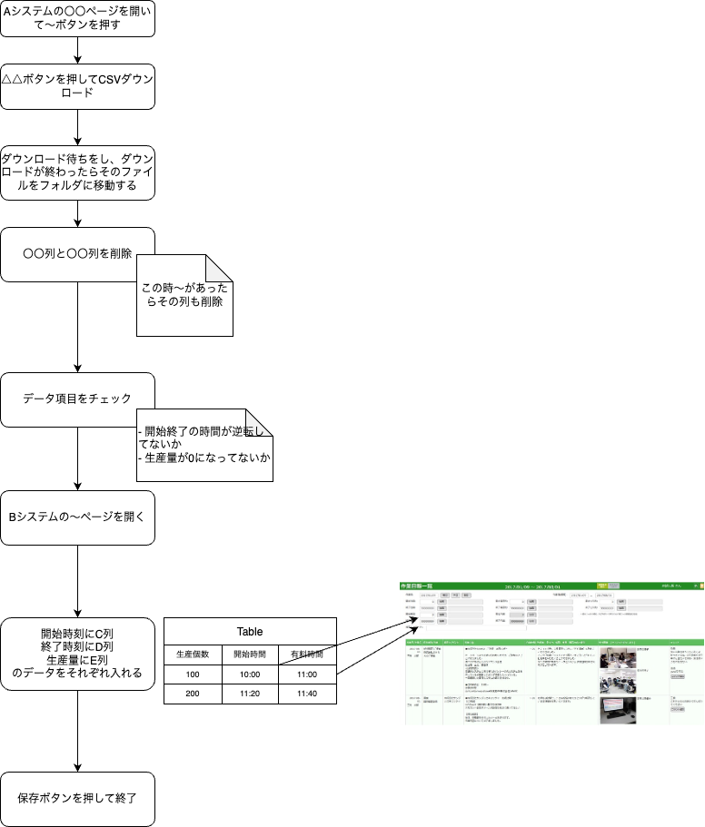

# 基幹システムに対して日報を入力する自動スクリプト

## 背景(なぜこの自動化をするのか)
- 日報入力は毎日行うため、自動化することで作業時間を短縮することができる
- また、日報の入力ミスを減らすことができる

## 効果
- 1日1回20分かかっていた日報入力を1分に短縮(月に20日*19分=380分の節約)
- 入力ミスが減ることで、日報の信頼性が向上する

## 元の業務フロー

## テスト項目チェックボックス
[] 

